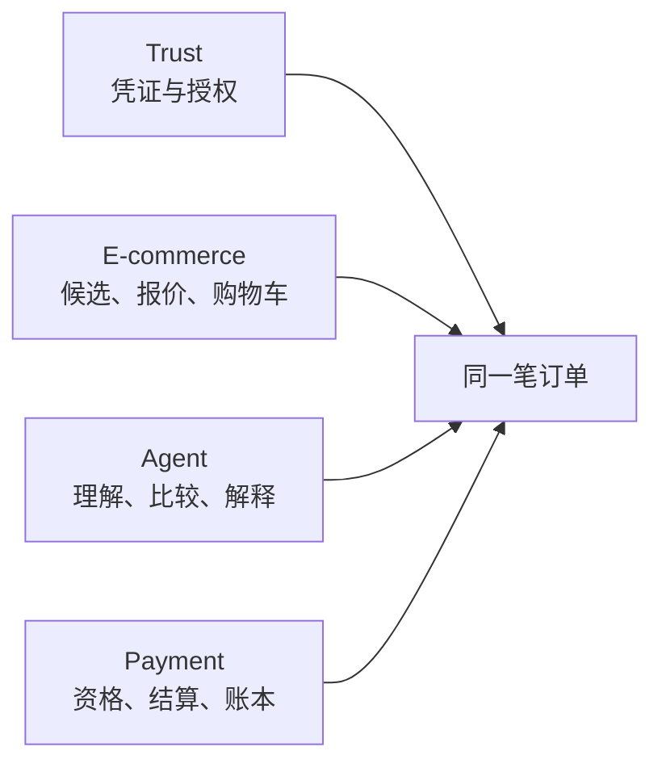
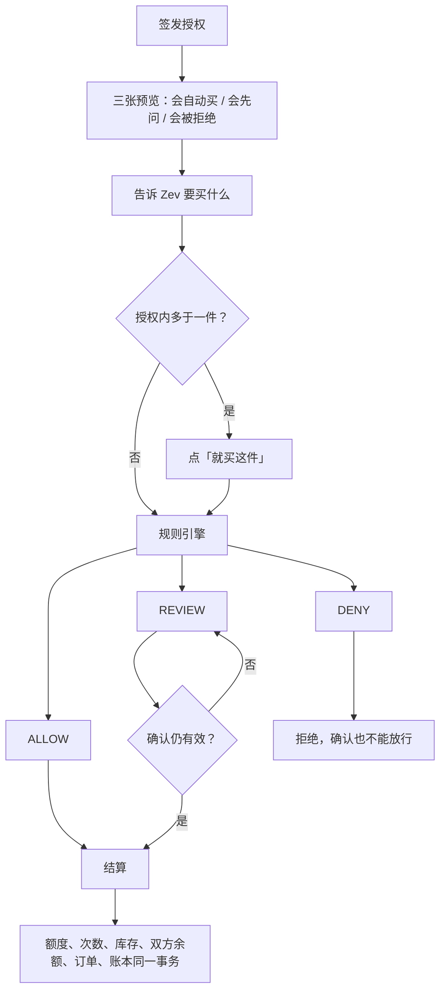
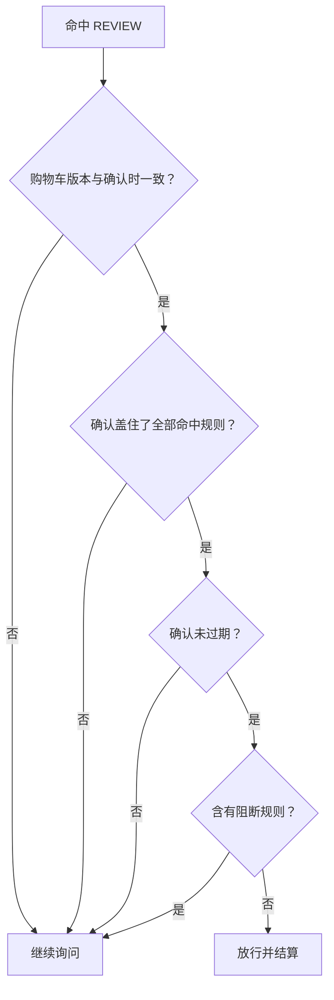
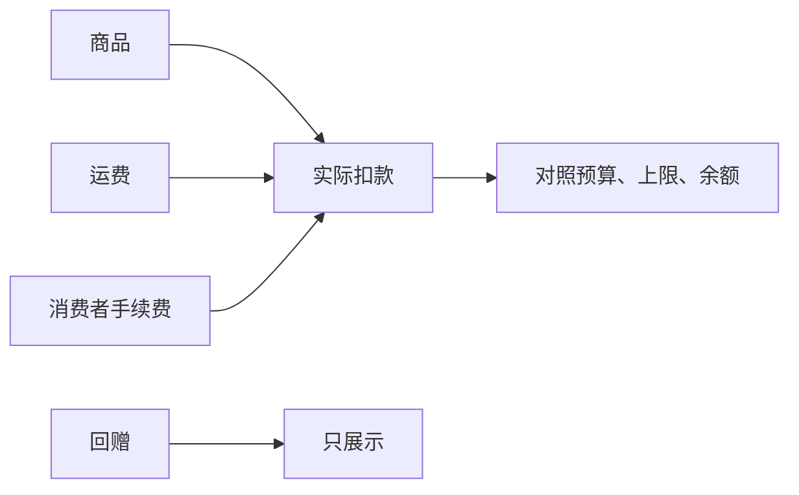
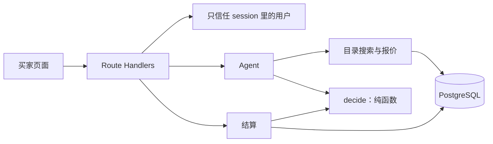

# MandateWallet

HacKU 2026 · FinTech PS1 “Give a Machine a Wallet – Agentic Commerce”

用户写下 AI 购物助理 **Zev** 的花钱边界：买什么、最多花多少、最多买几次、何时失效、哪些情况先问。Zev 在两个模拟商家的目录里比价；边界内从 Agent 零钱包付款，接近边界时暂停询问，越界时拒绝并引用用户自己写的规则。每一笔都能看到命中了哪条规则、哪一版授权、用了哪种支付方式。

四个维度落在同一笔交易上：

- **Trust**：买家与商家凭证决定谁能参与；授权书（mandate）决定 Zev 被允许做什么。
- **E-commerce**：任务、候选、含运费的报价、购物车版本、订单。
- **Agent**：理解这句话、搜索目录、比较、解释。金额和能不能买不采用模型的输出。
- **Payment**：先看 FPS 与 Tap & Go 的资格和成本，再在一个数据库事务里结算，并留下平衡账本和收据。



演示目录在 `fixtures/catalog.json`，共 500 件。前 98 件的 id 和价格保持不变，用来走自动完成、先问、拒绝这几条脚本。商品名写成「中文 / English」，界面按当前语言只显示一边。

## 线上

- 带数据库的站点：<https://mandate-wallet.vercel.app>（跟随 `main`）
- 浏览器内演示：<https://mandate-wallet-ui.vercel.app>（`DEMO_MODE`，数据在访问者浏览器里）

演示账号 `alex@demo.hk` / `demo1234`。登录页有「使用演示账号」。`DEMO_MODE` 下未登录也可以在首页问 Zev。

## 本地运行

需要 Node.js 与 PostgreSQL。

```powershell
npm install
Copy-Item .env.example .env.local
npm run db:migrate
npm run db:seed
npm run dev
```

`.env.local` 里至少填写 `DATABASE_URL` 和 `SESSION_SECRET`。Docker 可用时：

```powershell
docker compose up -d db
```

默认连接串是 `postgresql://mw:mw@localhost:5432/mandate_wallet`。应用在 <http://localhost:3000>。`npm run dev` 监听 `0.0.0.0:3000`，同一局域网可以用本机 IPv4 访问。

`DEEPSEEK_API_KEY` 留空时，Zev 用本地关键词从原话里认商品。填上之后才调用 DeepSeek，回复会标明来源。密钥只放在 `.env.local` 或部署环境变量里，不要提交。

`DEMO_MODE` 不是 `true` 时，`/demo` 和 `/api/demo/*` 返回 404。

## 一笔购买怎么走

1. 用户签发授权。签发前有三张预览：会自动买、会先问、会被拒绝。
2. 对 Zev 说要买什么。多于一件都在授权内时，必须点「就买这件」才会出现付款。
3. 规则引擎给出 `ALLOW`、`REVIEW` 或 `DENY`。`DENY` 不能靠确认放行。`REVIEW` 只在购物车版本一致、规则都覆盖到、确认未过期、且没有阻断规则时放行。
4. 结算自己重新构造上下文并调用引擎，不采用页面或模型传来的结论。授权额度、次数、库存、双方余额、订单和账本在同一个事务里更新；任一条件不满足就整笔回滚。



确认要同时满足四件事，少一件就继续停着：



金额在库里是整数分，接口用十进制字符串。预算和余额按商品 + 运费 + 消费者手续费判断。回赠只展示，不入账。



## 代码怎么分工

页面不自己决定能不能买。Agent 只负责听懂、找商品和解释。能不能付钱，由规则引擎在结算时用数据库里锁住的最新数据再算一遍。



## 常用命令

```powershell
npm run typecheck
npm run lint
npm run test:unit
npm run fixtures:validate
npm run demo:reset
```

`test:integration` 和 `test:scenarios` 需要 `TEST_DATABASE_URL`。

## 文档

- `docs/MANUAL.md`：产品与技术规格
- `docs/LOCAL_SETUP.md`：Windows 本地启动
- `docs/DECISIONS.md`：规格没有写死时的取舍
- `docs/PAYMENT_RAILS.md`：模拟结算里已执行的部分，以及接入 FPS / Tap & Go 时还要机构做什么
- `docs/rates/README.md`：费率观测、截图和适用范围
- `docs/EVIDENCE.md`：成本口径、尚未做的人工计时，以及和自己购物、普通对话助手的差别
- `AGENTS.md`：实现时不能违反的约束

## 边界

支付由模拟器执行。真实扣款、失败查询、退款和对账要支付机构的接口，见 `docs/PAYMENT_RAILS.md`。

FPS 的 0 手续费只对应汇丰个人客户经其 App 或网上理财做的本地港元转账。Tap & Go 的收费表没有写明本地港元消费手续费，观测值是未核实；演示账本里暂记的 0 不是这条费用的观测值，也不能用来说明它比 FPS 便宜。来源和观测时间写在 `fixtures/rates.json`。

商家凭证「验证通过」只表示所核验的条件通过。记录是可追溯的授权与交易决策，不表示记录不可被运营方改写。改地址的冷静期只在演示页面里，不是服务端的 24 小时锁定。
