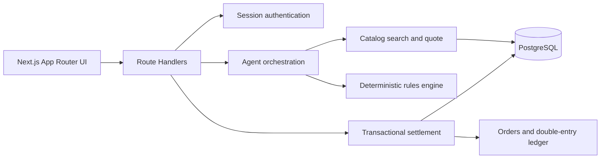

# MandateWallet · Zev

**MandateWallet** is an agentic commerce prototype for giving an AI shopping agent a controlled spending wallet. Users describe what they want to buy, define the boundaries the agent must follow, and receive a traceable record of every candidate, decision, confirmation, and simulated payment.

> **Live demo:** [https://mandate-wallet-ui.vercel.app/](https://mandate-wallet-ui.vercel.app/)
>
> **Local demo:** `http://localhost:3000`

MandateWallet is designed around a simple rule: **Zev can act within the mandate you sign, must pause when a configured review condition is triggered, and must refuse when a hard boundary is violated.**

## Product Overview

MandateWallet turns an everyday shopping request into a controlled agent workflow:

1. The user describes a purchase in natural language.
2. Zev extracts the shopping intent and searches the available catalog.
3. The system compares candidates, prices, shipping, delivery information, and merchant status.
4. A deterministic policy engine evaluates the request against the user's mandate.
5. An allowed request can be paid automatically through the simulated wallet.
6. A request requiring review appears in the confirmation inbox.
7. A request outside the mandate is denied and cannot be approved around the rule.
8. The complete task history remains available for inspection.

The product is aimed at everyday replenishment and controlled agentic commerce, such as buying laundry liquid, tissues, dish soap, or selecting a household item within a declared budget.

## Key Features

### Mandates and spending boundaries

Users can create a structured mandate that defines:

- What the agent may buy
- Allowed product categories
- Per-transaction spending limit
- Total allowance for the mandate
- Maximum number of successful purchases
- Expiration date
- Whether brand substitutions require confirmation
- Whether specific categories require confirmation
- Whether new merchants require confirmation
- Whether prices above a reference price require confirmation
- Allowed payment methods
- Standard or enhanced protection mode

Before signing, the interface previews representative outcomes as:

- **Allow:** Zev can complete the purchase automatically.
- **Review:** Zev must ask the user first.
- **Deny:** The purchase is outside the mandate and cannot be approved.

### Traceable agent workflow

Every task exposes the agent's work log, including:

- Intent extraction
- Catalog search
- Candidate comparison
- Quote construction
- Rule evaluation
- Cart version creation
- Confirmation status
- Payment and receipt information

The agent is responsible for understanding requests, searching, comparing, and explaining. It does not make policy decisions. Authorization and payment decisions are evaluated by the server-side rule engine.

### Rules-first authorization

The policy engine uses stable rule IDs and deterministic outcomes:

- `ALLOW`
- `REVIEW`
- `DENY`

Hard-deny examples include:

- Revoked or expired mandate
- Invalid buyer credential
- Invalid merchant credential
- Disallowed category
- Product specification not met
- Per-transaction cap exceeded
- Total allowance exceeded
- Purchase count exhausted
- Payment method not allowed
- Expired quote

Review examples include:

- The purchase is close to the spending cap
- The product uses a substitute brand
- The product belongs to a watched category
- The merchant is new
- The price is above the reference price

The priority is always:

```text
DENY > REVIEW > ALLOW
```

### Wallet and simulated payment

The Agent pocket is kept separate from the user's signed mandate allowance. Users can inspect:

- Pocket balance
- Funding activity
- Mandate allowance
- Remaining purchase count
- Payment method eligibility
- Simulated receipts

Payment runs through a transactional settlement flow with idempotency protection, inventory checks, allowance updates, account balances, orders, and ledger entries.

### Confirmation inbox

When a task triggers a review rule, it appears in the **To approve** inbox. A confirmation is bound to:

- The task
- The cart version
- The triggered rule IDs
- An expiration time

If the quoted cart changes, the original confirmation is no longer valid and the task must be evaluated again.

### Records and explanations

The records page connects:

```text
Mandate → Task → Candidates → Decision → Confirmation → Payment → Receipt
```

Users can inspect why an action was allowed, paused, or denied, including the mandate version and the rules that were triggered.

### Security and account controls

The prototype includes account-oriented controls for:

- Passkey-style step-up confirmation in the demo flow
- New-device warnings
- Account freeze behavior
- Credential and verification status
- Delivery address management
- User preferences
- Connected funding providers
- English/Chinese language switching

### Demo controls

When `DEMO_MODE=true`, the demo control panel can be used to demonstrate safety scenarios such as:

- Revoking a merchant credential
- Revoking a mandate
- Simulating an issuer decline
- Resetting demo data
- Switching between LLM and fallback behavior

## Live Demo Walkthrough

Open the [public demo](https://mandate-wallet-ui.vercel.app/) and explore the following flow:

1. Start from the **Home** page.
2. Enter a shopping request or choose one of the suggested prompts.
3. Open **New mandate** to define a spending boundary.
4. Review the preview cards before signing the mandate.
5. Open **Wallet** to inspect the Agent pocket and active mandates.
6. Create a task and inspect Zev's work log.
7. Use **To approve** for tasks that require user confirmation.
8. Open **Records** to inspect completed and denied tasks.
9. Open **Me** to review security, verification, address, preference, and connection settings.
10. Use **Demo controls** to reproduce approval, denial, revocation, and payment-failure scenarios.

The demo is available in both Chinese and English through the language toggle in the application shell.

## Application Pages

| Route | Purpose |
| --- | --- |
| `/` | Home dashboard, shopping prompt, allowance summary, pending confirmations, recent tasks, and recent transactions |
| `/task/new` | Create a task or draft a mandate from a shopping request |
| `/task/[id]` | Inspect the agent run, candidates, decisions, confirmation, payment, and receipt |
| `/wallet` | Inspect the Agent pocket, funding activity, mandates, and payment-method comparison |
| `/inbox` | Review tasks that require confirmation |
| `/ledger` | Browse traceable task, decision, payment, and receipt records |
| `/mandate/new` | Create a mandate and preview its outcomes before signing |
| `/mandate/[id]` | Inspect a mandate, its limits, versions, and status |
| `/pay-methods` | Compare available simulated payment methods and observed fees/rewards |
| `/me` | Manage security, verification, address, preferences, and connections |
| `/demo` | Demonstration controls available only when `DEMO_MODE=true` |

## Architecture



The system is intentionally separated into four concerns:

- **Trust:** buyer and merchant credentials, mandate status, expiration, and revocation.
- **E-commerce:** tasks, candidates, quotes, cart versions, orders, and receipts.
- **Agent:** intent extraction, search, comparison, ranking, and explanations.
- **Payment:** method eligibility, simulated settlement, idempotency, and ledger posting.

Important design principles:

- The rules engine is a pure, deterministic function and does not perform I/O.
- The settlement path reconstructs the decision context from locked database state instead of trusting the frontend or an agent response.
- LLM output is limited to intent extraction and explanations; it does not decide authorization or payment.
- All monetary calculations use integer minor units (`BIGINT`), with HKD as the product currency.
- Database writes for settlement happen in one transaction.

## Technology Stack

- Next.js 16 with the App Router
- React 19 and TypeScript
- PostgreSQL
- `pg` and SQL migration files
- Tailwind CSS and shadcn/ui
- Zod for runtime validation
- bcryptjs for password hashing
- Vitest for unit, integration, and scenario tests
- Optional OpenAI-compatible LLM provider for agent assistance

## Local Development

### Prerequisites

- Node.js 22 or a compatible current LTS release
- npm
- PostgreSQL, either locally installed or through Docker Desktop

### 1. Install dependencies

```powershell
npm install
```

### 2. Configure environment variables

Create `.env.local` in the project root:

```env
DATABASE_URL=postgresql://mw:mw@localhost:5432/mandate_wallet
TEST_DATABASE_URL=postgresql://mw:mw@localhost:5432/mandate_wallet
SESSION_SECRET=replace-with-a-random-secret
DEMO_MODE=true

# Optional OpenAI-compatible provider configuration
LLM_BASE_URL=
LLM_MODEL=
LLM_API_KEY=
FORCE_FALLBACK=false
```

Do not commit `.env.local` or production credentials.

### 3. Start PostgreSQL with Docker

The repository includes a PostgreSQL service in `compose.yaml`:

```powershell
docker compose up -d db
```

Check the service:

```powershell
docker compose ps
```

If Docker Desktop is not available, install PostgreSQL locally and update `DATABASE_URL` accordingly.

### 4. Run migrations and seed demo data

```powershell
npm run db:migrate
npm run db:seed
```

The seed script creates the reference merchants, products, payment methods, demo buyer, credentials, and initial simulated funding.

### 5. Start the application

```powershell
npm run dev
```

Open [http://localhost:3000](http://localhost:3000).

The dev server listens on `0.0.0.0:3000`, so teammates on the same network can use `http://<your-lan-ip>:3000` when firewall and Wi-Fi isolation rules allow it.

## Demo Account

The seed script prints the demo credentials. The default demo account is:

```text
Email:    alex@demo.hk
Password: demo1234
```

Use the credentials only in a local or demonstration environment. Change the seed data and session configuration before any production deployment.

## Useful Commands

```powershell
npm run dev              # Start the development server
npm run build            # Create a production build
npm run start            # Start the production server
npm run lint             # Run ESLint
npm run typecheck        # Run TypeScript checks
npm run db:migrate       # Apply pending SQL migrations
npm run db:seed          # Seed reference and demo data
npm run demo:reset       # Reset demo state
npm run fixtures:validate # Validate fixture files
npm run test:unit        # Run unit tests
npm run test:integration  # Run integration tests
npm run test:scenarios    # Run scenario tests
```

## Database and Migrations

Migrations are applied in filename order and tracked in the `schema_migrations` table. The core schema covers:

- Users and sessions
- Buyer and merchant credentials
- Mandates and mandate events
- Tasks and agent runs
- Carts and cart versions
- Decisions and confirmations
- Orders and payment attempts
- Accounts, journals, and ledger entries
- Support requests and audit events
- User preferences and demo state

Do not edit an already-applied migration in a shared environment. Add a new numbered migration instead.

## Testing Scenarios

The project is built around five safety and correctness scenarios:

| Scenario | Expected behavior |
| --- | --- |
| Automatic completion | A candidate within the mandate is paid automatically and recorded in the ledger |
| Review required | A configured review condition pauses the task until the user confirms |
| Hard denial | A cap, credential, category, or mandate violation is denied without an approval path |
| Duplicate and overspend protection | Idempotency and transaction locking prevent duplicate payment and negative balances |
| Traceability | The records page shows the mandate version, candidate, rules, payment method, and receipt |

Run the test suites with:

```powershell
npm run test:unit
npm run test:integration
npm run test:scenarios
```

## Project Documentation

- [`docs/MANUAL.md`](docs/MANUAL.md) — product and technical specification
- [`docs/DECISIONS.md`](docs/DECISIONS.md) — architecture and product decisions
- [`docs/CURSOR_PROMPTS.md`](docs/CURSOR_PROMPTS.md) — development prompts and stages
- [`AGENTS.md`](AGENTS.md) — project invariants and engineering constraints
- [`fixtures/README.md`](fixtures/README.md) — fixture format and validation

## Scope and Limitations

This is a controlled prototype and demonstration environment.

- Payments are executed by a simulator and do not move real money.
- Merchant credential verification only means that the checked conditions passed; it does not mean that a merchant is universally trustworthy.
- Fees and rewards are observations from public information at a particular time and may not remain current.
- Rewards are estimates and are not treated as guaranteed savings or used as authorization inputs.
- The catalog is a controlled demonstration catalog; it is not a general marketplace integration.
- The agent does not bypass merchant security controls, payment authentication, or platform restrictions.
- Real payment, merchant onboarding, production identity verification, and external commerce integrations would require additional provider agreements and security review.
- The public Vercel deployment is intended for product demonstration, not production financial use.

## Branches and Collaboration

- `main` — integration branch and runnable product baseline
- `feat/ui-*` — user interface and integration work
- `feat/core-*` — rules engine, settlement, and deployment work
- `data/fixtures` — catalog, rates, and scenario fixtures
- `docs/pitch` — pitch and presentation materials

## License and Attribution

This project was developed for HacKU 2026 · FinTech PS1, **“Give a Machine a Wallet — Agentic Commerce.”** It uses open-source technologies including Next.js, React, Tailwind CSS, shadcn/ui, PostgreSQL, `pg`, Zod, bcryptjs, and Vitest. AI-assisted development tools were used during implementation.
